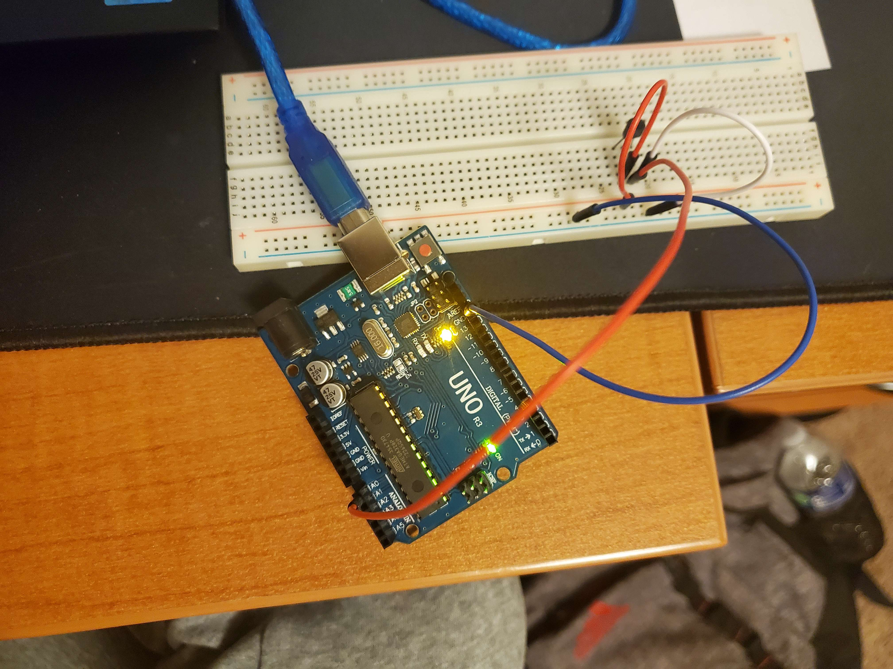

# Arduino Temperature Website
Collect current temperature and display the data onto website

# Requirement
* Javascript/Typescript
* Serial port library
* Arduino
* breadboard
* male to male wires

# Notes
Project is still ongoing. I am still try to workout the optimise the javascript

